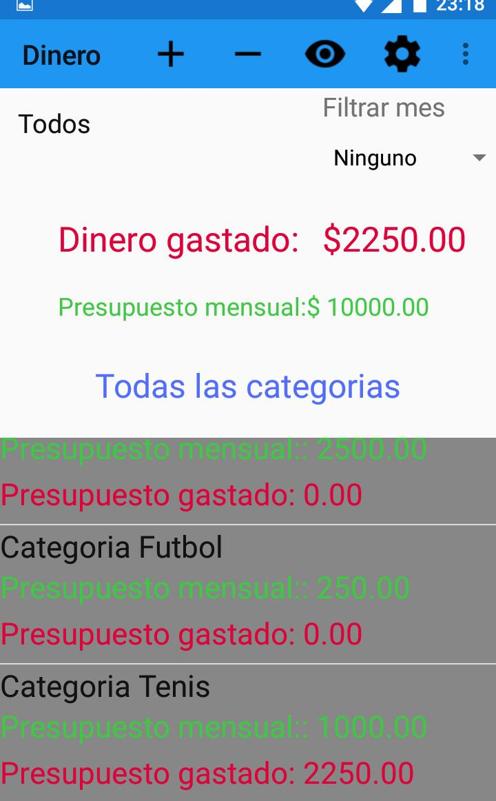
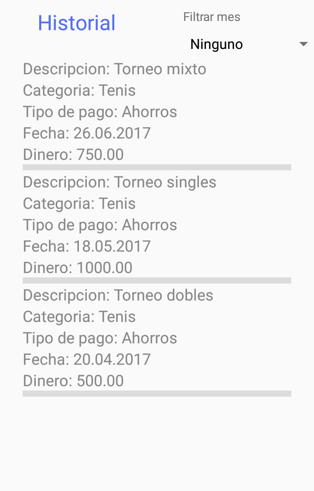
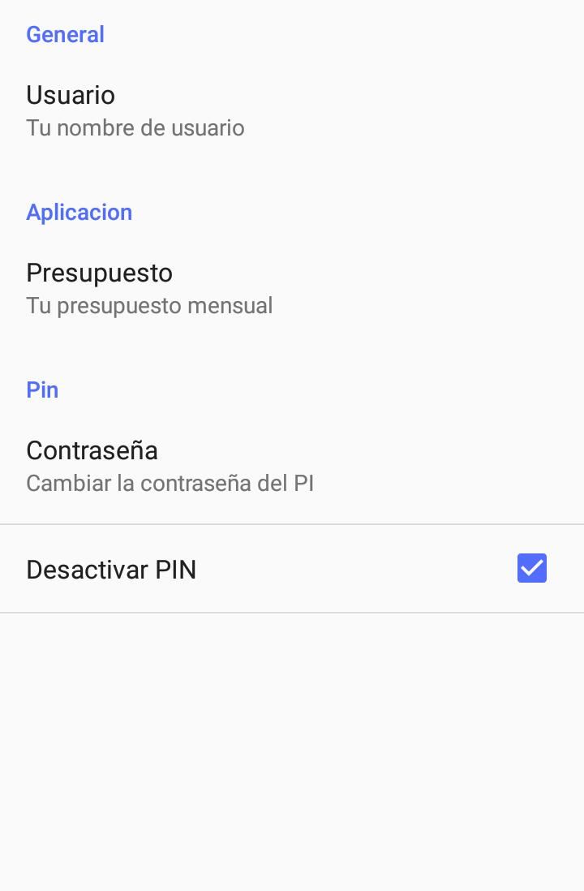

## Aplicacion de gastos mensuales

**Descripcion:**
Trabajo práctico del quinto cuatrimestre de la Escuela DaVinci diseñado en Android Studio con la finalidad de resumir lo visto en la materia.
La aplicacion trata de una agenda virtual en donde se guardan los gastos diarios los cuales cada uno tienen sus categorias y tipos de pago. Ademas con la posibilidad de que el usuario cree sus propias categorias y tipos de pago.
Adicionalmente cuenta con un PIN de seguridad

**Tecnologias usadas:**
Android Studio y Java

Inicio:

 
Historial:

 
Preferencias:

 
